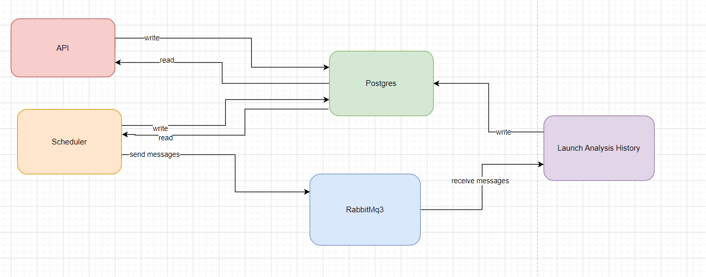

# Domain Analysis Project

The following project have for final goal the creation of an API where a user can do two main actions: 
* Add a domain for a analysis (like google.com)
* Get the last analysis of a domain previously provided

To do this some different services were required:
* A Node Ts Api service containing the API source code
* A Postgres service to be used as a database
* A RabbitMQ service used to process messages between services
* A Node Ts service responsible for launching the analysis on the domains on a scheduled base
* A Node Ts service responsible for executing the analysis of a domain

We will now describe the different services and the relations between them

## Postgres Service

This service is a a postgress database containing different tables. 
These tables will be created on the initialization of the database using the script **init-scripts/init.sql** 
It includes 3 tables:
* domains: contains the list of domains to anlyse
* domains_analysis_history: will store the different analysis proceeded for each domains
* api_request_history: will store the differents requests sent to the API

## API service

The source code of the API is a Node Ts application running with Express to set up the API.  
The structure of the API is basic: The express api is made of routes talking with controllers, these controllers use different services and data models.  
This API will communicate with the postgress database to send and receive data.  
2 Requests are available in the API:  
* GET http://localhost:8080/domain-analysis?domain={domain}, to get the last analysis processed on a specfic domain (if the domain is not in the list for analysis it will be added to it)
* POST http://localhost:8080/domain-analysis?domain={domain}, to add a domain to the list for analysis, be careful you cannot add a domain that was already previously added.

## RabbitMq3

This service is a simple RabbitMQ instance used by the next services to communicate between them, the usage of such a service is necessary since the amount of domain analysis to run can be high and we don't want to overload the next services or the API calls they are going to make.  

## Scheduler

This service is a scheduler that will run every ten seconds to check if some domains need a new analysis.  
By default for a specific domain a new analysis will be run **every 31 days**, this interval can be edited in the environement variable **SECOND_ANLYSIS_INTERVAL** from this service (as the number of seconds between two analysis of the same domain)   
If some domains are found they will be sent to the RabbitMq Queue defined previously and wait for analysis.  
This service will use the RabbitMQ3 service and the Postgress Service.  

## Launch Analysis History

This service will receive messages from the RabbitMQ queue defined previously.   
Each message will be a new analysis to run and save for a specific domain.  
The service will retrieve information from the domain check endpoint of the whois API and the virus total API.  
Once the analysis ran and the data was collected it will be saved in the postgres database under the table **domains_analysis_history**.  
Note that this service will not proceed more than 10 message concurently (in order to avoid errors from the Whois and Virus total APis for too much request, code 429) to update this limit update the environement variable **CONCURENT_MESSAGE_HANDLING** of this service.  
This service will use the RabbitMq3 service and the postgres service.  

## Relation between services

Here is a summary of all the relations between the different services.  

